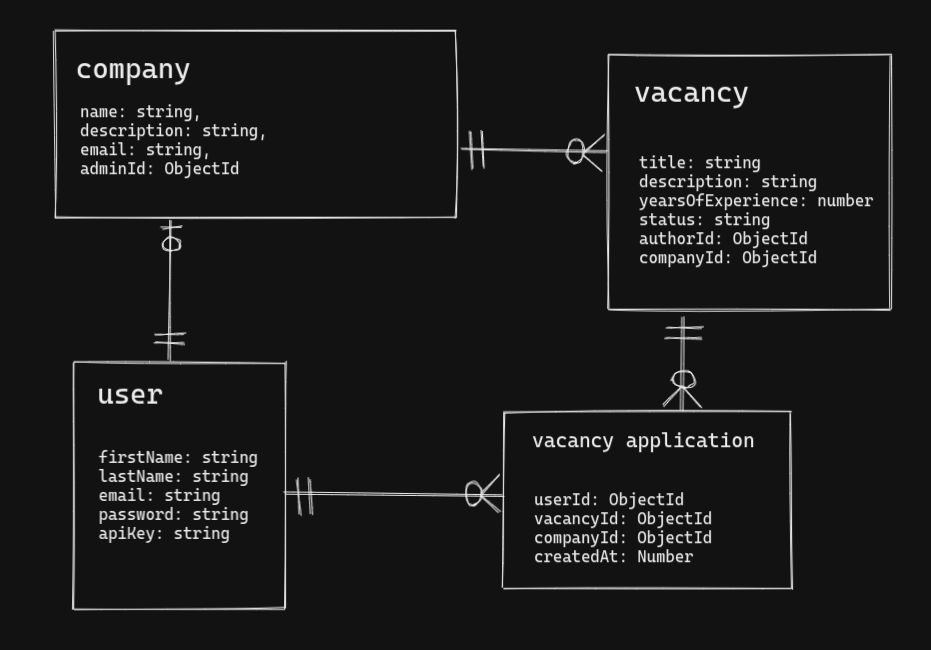

# Job Board

A system to facilitate connection between users and companies where companies can post jobs and users can browse them and apply to them

## ERD

## Exported APIs
The system provides some initial APIs to use: 
1. User Registration API 
1. User Login API
1. Company Creation API
1. Vacancy Creation API
1. Vacancy Status Update API
1. List Vacancies API
1. Filter Vacancies By Years Of Experience API

You can find examples for each request in [the system postman collection](https://www.getpostman.com/collections/5ef784f27aa6d2aa71bb)

## Future work
To add the rest of CRUD operations for the system entities